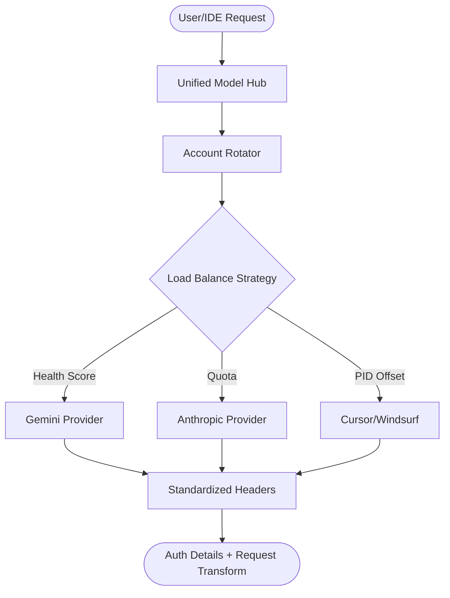

# 👹 OpenCode Auth Monster

A high-performance, production-ready multi-provider OAuth and API Key toolkit designed for OpenCode, Claude Code, and other agentic IDEs.

Auth Monster handles the "dirty work" of authentication, token rotation, rate limiting, and cross-model compatibility, allowing you to focus on building agentic workflows.

## 🏗️ Architecture



## 🚀 Quick Start

### Installation

```bash
curl -sSL https://raw.githubusercontent.com/sephiroth/opencode-auth-monster/main/scripts/install.sh | bash
```

Or manually:

```bash
git clone https://github.com/sephiroth/opencode-auth-monster.git
cd opencode-auth-monster
npm install
npm run build
sudo npm install -g .
```

### Setup

Run the interactive onboarding wizard to configure all your accounts in one go:

```bash
opencode-monster setup
```

## 🛠️ CLI Reference

| Command | Description |
| :--- | :--- |
| `setup` / `onboard` | Run the interactive configuration wizard |
| `list` | List all accounts, their providers, and health scores |
| `status` | Show general system health and active provider |
| `switch <provider>` | Change the primary active provider |
| `sync <repo>` | Push your account tokens to GitHub Secrets |
| `test <model>` | Test the auth flow for a specific model |

## 🔌 Supported Providers

| Provider | Auth Methods | Features |
| :--- | :--- | :--- |
| **Gemini** | OAuth, API Key | Managed Onboarding, Google OAuth refresh |
| **Anthropic** | OAuth, API Key | Deep Spoofing, Tool Prefixing, Thinking Warmup |
| **Cursor** | JWT / Token | Cross-model Sanitization, Header Spoofing |
| **Windsurf** | gRPC / Token | Automated Discovery, Model Mapping |
| **OpenAI** | API Key | Standard Rotation |
| **Copilot** | OAuth / Token | GitHub Integration |

## 🛡️ Stability Features

### 🔄 Intelligent Rotation & Load Balancing
- **Sticky**: Pins to one account until it hits a limit.
- **Round-robin**: Distributes load evenly across all healthy accounts.
- **Hybrid (Score + Tokens)**: Uses a combination of Health Scores and usage metrics to pick the optimal account.
- **PID Offset**: Uses the Process ID (PID) to initialize rotation cursors. This ensures that multiple parallel IDE instances or subagents don't all pick the same account at the same time, maximizing total throughput.

### 📉 Rate Limit Deduplication (Dedup)
Prevents "backoff explosion" by deduplicating concurrent 429 (Rate Limit) errors within a 2-second window. This ensures that a burst of requests doesn't unnecessarily tank your account health.

### 🧠 Thinking Warmup
Automatically "wakes up" reasoning models (like Claude 4.5 Opus) when switching accounts by sending a lightweight background request. This reduces latency for the user's first interaction with a fresh account.

### 🧼 Cross-Model Sanitizer
Automatically strips conflicting headers and system prompt signatures when switching between different model providers (e.g., removing Gemini-specific instructions before sending to Claude).

## 📝 License

ISC License - see [LICENSE](LICENSE) for details.
