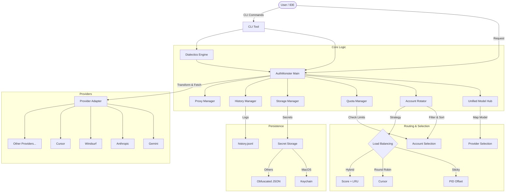

# SYSTEM KNOWLEDGE GRAPH: OpenCode Auth Monster

## 1. High-Level Architecture

## 2. Entity-Relationship Model

### ManagedAccount
| Field | Type | Description |
| :--- | :--- | :--- |
| `id` | string | Unique identifier. |
| `provider` | AuthProvider | The service provider (e.g., `gemini`, `anthropic`). |
| `tokens` | OAuthTokens | OAuth access/refresh tokens. |
| `apiKey` | string | API Key (alternative to OAuth). |
| `healthScore` | number | Dynamic reliability score (0-100). |
| `quota` | object | Remaining quota tracking. |
| `usage` | object | Accumulated cost and token usage. |
| `metadata` | object | Provider-specific data (e.g., `csrfToken`, `port` for Windsurf). |

### AuthMonsterConfig
| Field | Type | Description |
| :--- | :--- | :--- |
| `active` | AuthProvider | Default active provider. |
| `fallback` | AuthProvider[] | List of fallback providers. |
| `method` | AuthMethod | Rotation strategy (`sticky`, `round-robin`, `hybrid`). |
| `modelPriorities` | Map | Model fallback chains. |
| `thinking` | object | Settings for reasoning models. |

## 3. Component Registry

| Component | File | Responsibility |
| :--- | :--- | :--- |
| **AuthMonster** | `src/index.ts` | Main facade. Orchestrates storage, rotation, and request execution. Handles retries and fallbacks. |
| **UnifiedModelHub** | `src/core/hub.ts` | Routes generic model names (e.g., `gemini-3-flash`) to specific provider implementations. |
| **AccountRotator** | `src/core/rotation.ts` | Selects the best account based on health and strategy. Implements rate limit deduplication. |
| **QuotaManager** | `src/core/quota-manager.ts` | Manages operational quotas, cooldowns, and pre-flight checks. Caches cooldown status. |
| **DialecticsEngine** | `src/core/dialectics.ts` | Implements "thesis-antithesis-synthesis" by querying two models in parallel and synthesizing the result. |
| **SecretStorage** | `src/core/secret-storage.ts` | Manages secure storage of credentials using macOS Keychain (via `security` CLI) or obfuscated files. |
| **StorageManager** | `src/core/storage.ts` | Manages persistence of accounts, using `SecretStorage` for sensitive data. |
| **ProxyManager** | `src/core/proxy.ts` | Configures and provides HTTP/SOCKS agents for requests. |
| **HistoryManager** | `src/core/history.ts` | Logs request/response metadata and costs for auditing. |
| **Providers** | `src/providers/*` | Specialized adapters for each service (Gemini, Anthropic, Windsurf, etc.). |

## 4. Operational Constraints & Logic

### Account Selection
1.  **Filtration**: Accounts are filtered out if:
    *   `rateLimitResetTime` is in the future.
    *   `cooldownUntil` is in the future (managed by `QuotaManager` & `Rotator`).
    *   `healthScore` < 50.
    *   Explicitly marked unhealthy.
2.  **Strategies**:
    *   **Sticky**: Uses `process.pid % accounts.length` to assign a stable account to the current process.
    *   **Round-Robin**: Rotates sequentially per request.
    *   **Hybrid**: Prioritizes Health Score, then Least Recently Used (LRU), with PID offset.
    *   **Quota-Optimized**: Selects account with highest remaining quota.

### Error Handling
*   **Rate Limits (429)**: Triggers temporary backoff. Concurrent 429s within 2s are deduplicated.
*   **Failures**: Decreases health score.
*   **Success**: Increases health score and resets consecutive failures.
*   **Parking**: If all accounts are rate-limited, the system pauses execution (up to 60s) to wait for a reset.

### Special Mechanisms
*   **Dialectics**: Parallel execution of two models + synthesis step.
*   **Thinking Warmup**: Sends a dummy request to "wake up" reasoning models (Anthropic) when switching accounts.
*   **Windsurf gRPC**: Uses a specialized gRPC-over-HTTP implementation via `streamChat` instead of standard fetch.
*   **Cross-Model Sanitization**: Strips incompatible headers/prompts when switching providers.

## 5. Data Flow
1.  **Request**: User calls `request(model, ...)`
2.  **Resolution**: `UnifiedModelHub` resolves the model chain (primary + fallbacks).
3.  **Selection**: Loop through chain:
    *   `QuotaManager.preflightCheck` verifies usability.
    *   `AccountRotator` picks best account.
4.  **Execution**:
    *   `AuthMonster` transforms request (Provider-specific + Sanitization).
    *   Executes via `proxyFetch` or `WindsurfProvider` (gRPC).
5.  **Post-Processing**:
    *   Collect stats (tokens/cost).
    *   Log to `HistoryManager`.
    *   Update Health/Quota.
    *   Handle 429/Errors (Retry/Fallback).
