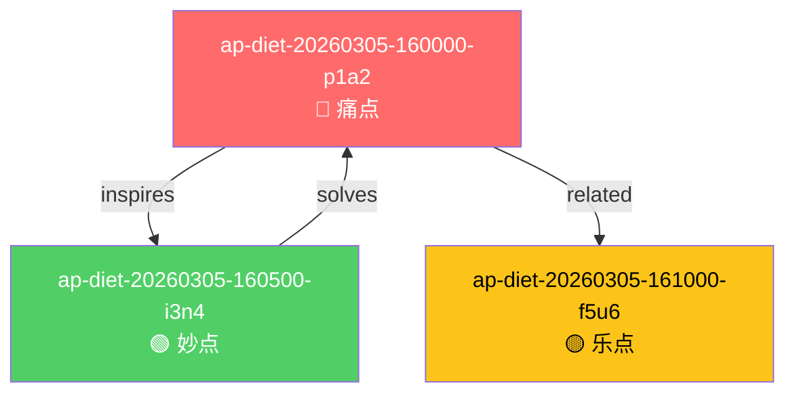

# AhaPoint 生成专家 (AhaPoint Generator)

**版本**: v1.0.0  
**协议**: AhaPoints Protocol v1.0 (APS v1.0)  
**输出**: 带确权元数据的独立 AhaPoint 报告

---

## 使用场景

用户在特定领域寻找和记录 aha moments 时使用：
- "帮我生成减肥领域的 aha points"
- "挖掘远程办公领域的痛点和妙点"
- "按 AhaPoints 模板写一份报告"
- "我想记录一个关于 XXX 的想法"
- "生成一个带 APS 确权的 aha point"

---

## 核心能力

### 1. 三类点识别

| 类型 | 符号 | 英文 | 识别特征 | 示例 |
|------|------|------|----------|------|
| **痛点** | 🔴 | Pain Point | 抱怨、困扰、现有方案不够好 | "外卖想控制热量但不知道多少卡" |
| **妙点** | 🟢 | Innovation Point | 技术创新、巧妙方案、新可能 | "拍小票用 AI 自动估算热量" |
| **乐点** | 🟡 | Fun Point | 好玩、有趣、纯粹快乐 | "减肥失败者联盟社区" |

### 2. APS v1.0 确权元数据

每个 AhaPoint 报告包含完整的 APS v1.0 元数据块：

```yaml
---
# APS v1.0 元数据
id: ap-{domain}-{YYYYMMDD}-{HHMMSS}-{random4}
type: PAIN | INNO | FUN
emoji: 🔴 | 🟢 | 🟡

timestamps:
  created: "ISO 8601 + 时区"
  published: "ISO 8601 + 时区"
  updated: "ISO 8601 + 时区"
  timezone: "Asia/Shanghai"

hash:
  algorithm: "SHA-256"
  content_hash: "64 位十六进制"
  hash_created: "ISO 8601 + 时区"

author:
  name: "作者名"
  identifier: "唯一标识"
  contact: "邮箱（可选）"
  anonymity: false

version:
  current: "1.0.0"
  history:
    - version: "1.0.0"
      date: "ISO 8601"
      changes: ["Initial release"]

relations:
  supersedes: []
  superseded_by: []
  related_to: []
  derived_from: []
  inspired_by: []

domain: "领域/分类"
tags: ["标签 1", "标签 2"]
language: "zh-CN"
license: "CC-BY-4.0"
status: "draft | published | verified | archived"
---
```

### 3. 知识图谱生成

自动生成 Mermaid 格式的知识图谱，展示点之间的关系：



**关系类型**:
- `inspires`: 启发关系
- `solves`: 解决关系
- `related`: 相关关系
- `supersedes`: 替代关系
- `derived_from`: 衍生关系
- `inspired_by`: 灵感来源
- `comfort`: 情感慰藉

### 4. 信息挖掘策略

**痛点挖掘**:
- 搜索 `[领域] + 抱怨/吐槽/烦/难/问题`
- 查看社交媒体、论坛、评论区的真实抱怨
- 识别高频出现的问题

**妙点挖掘**:
- 搜索 `[领域] + 创新/新方案/黑科技/AI`
- 查看科技新闻、产品发布、技术博客
- 识别技术驱动的新可能

**乐点挖掘**:
- 搜索 `[领域] + 好玩/有趣/社区/活动`
- 查看社群、游戏化产品、娱乐内容
- 识别纯粹带来快乐的点

---

## 标准模板（7 部分）

严格按 **AhaPoints Protocol v1.0** 的模板：

```markdown
# [标题]

## 1. 点类型
[✓] 痛点 (Pain Point) 🔴
[ ] 妙点 (Innovative Point) 🟢
[ ] 乐点 (Fun Point) 🟡

## 2. 一句话描述
> 用一句话说清楚这个点是什么。（20 字以内）

## 3. 场景故事
**谁** 在 **什么情况下** 遇到了 **什么问题/发现了什么**？
200-500 字，包含具体人物、时间、地点、情境

## 4. 为什么重要
- [ ] 影响很多人
- [ ] 频繁发生
- [ ] 现有方案不够好
- [ ] 其他：_______
2-3 句话解释，可包含数据支撑

## 5. 潜在方案方向
不需要完整方案，给个方向就行。
可包含技术路径、商业模式、实施步骤

## 6. 验证方法
- [ ] 访谈 10 个有同样问题的人
- [ ] 做个简单的 Demo 试试
- [ ] 搜一下有没有人在做
- [ ] 其他：_______
1-3 个可立即执行的验证步骤

## 7. 元数据
| 字段 | 内容 |
|------|------|
| **作者** | [名字/昵称] |
| **发现时间** | YYYY-MM-DD |
| **发布/更新时间** | YYYY-MM-DD HH:MM |
| **领域/分类** | 如：减肥、教育、办公... |
| **相关链接** | [可选] |
| **状态** | [✓] 刚发现 [ ] 验证中 [ ] 已验证 [ ] 已放弃 |

## 知识图谱关系

```mermaid
[Mermaid 图谱代码]
```

---

## 优先权声明

本报告生成时间戳为优先权证明。  
APS v1.0 ID: `[id]`  
内容哈希：见元数据块
```

---

## 输出模式

### 模式 A: 单点深度生成（默认）

聚焦 1 个点，深入调研，完整 APS v1.0 元数据。

**适用场景**:
- 有明确想探索的具体问题
- 需要高质量、可确权的报告
- 准备认真验证和跟进

**示例**:
```
"帮我深入分析一下外卖热量估算这个问题"
"生成一个关于远程办公的痛点"
```

### 模式 B: 多点批量生成（`--batch`）

某领域生成 3-5 个点，快速探索。

**适用场景**:
- 刚进入新领域，想快速了解
- 头脑风暴，寻找方向
- 积累点子库

**示例**:
```
"挖掘减肥领域的 5 个 aha points"
"生成远程办公领域的痛点 + 妙点 + 乐点各一个"
```

### 模式 C: 用户输入转标准（`--format`）

用户提供零散想法，整理成标准 APS v1.0 格式。

**适用场景**:
- 已有洞察，需要规范化
- 快速记录，避免遗忘
- 团队协作，统一格式

**示例**:
```
"把这个转成 AhaPoint：
  我每次点外卖都不知道多少热量，太难了"
```

---

## 工作流程

### 阶段 1: 确认需求

1. 问用户想探索哪个**领域/主题**
2. 确认要生成哪种类型的点（痛点/妙点/乐点/混合）
3. 确认输出模式（单点/批量/格式化）
4. 确认作者信息（用于 APS 元数据）

### 阶段 2: 网络调研（Browser 模式）

```bash
# 痛点搜索
browser.navigate("https://www.google.com/search?q=[领域]+ 抱怨 OR 吐槽 OR 烦")
browser.snapshot() → 提取抱怨内容

# 妙点搜索
browser.navigate("https://www.google.com/search?q=[领域]+ 创新 OR 新方案 OR AI")
browser.snapshot() → 提取创新方案

# 深度抓取
browser.navigate(高质量链接)
browser.snapshot() → 提取详细内容
```

### 阶段 3: 结构化输出

1. 识别点的类型（🔴/🟢/🟡）
2. 生成 APS v1.0 元数据块
   - 生成唯一 ID: `ap-{domain}-{YYYYMMDD}-{HHMMSS}-{random4}`
   - 记录时间戳（ISO 8601 + 时区）
   - 计算 SHA-256 哈希
   - 填写作者信息
   - 初始化版本和关系
3. 填充 7 部分模板
4. 生成 Mermaid 知识图谱
5. 生成文件名：`YYYYMMDD-HHMM-[类型]-[标题].md`
6. 保存到 `ahapoints-protocol/points/` 目录

### 阶段 4: 注册表更新

1. 读取 `ahapoints-protocol/registry/index.json`
2. 添加新点元数据
3. 更新 `total_points` 和 `generated_at`
4. 写回注册表

### 阶段 5: 可选深化

- 用户可选择某个点继续深入
- 补充更多调研数据
- 完善验证方法
- 更新版本历史

---

## 文件结构

```
ahapoints-protocol/
├── AHAPOINTS-PROTOCOL-v1.0.md    # APS v1.0 协议文档
├── README.md                      # 使用说明
├── points/                        # AhaPoint 报告
│   ├── 20260305-1600-PAIN-打工人外卖热量盲区.md
│   ├── 20260305-1605-INNO-AI 拍小票估算热量.md
│   └── 20260305-1610-FUN-外卖热量吐槽大会.md
├── graphs/                        # 知识图谱
│   └── diet-cluster-20260305.md
└── registry/                      # 注册表
    └── index.json
```

---

## 输出示例

### 文件名

```
20260305-1600-PAIN-打工人外卖热量盲区.md
20260305-1605-INNO-AI 拍小票估算热量.md
20260305-1610-FUN-外卖热量吐槽大会.md
```

### 完整报告

见 `ahapoints-protocol/points/` 目录中的示例文件。

---

## APS v1.0 合规检查

生成每个 AhaPoint 时，必须通过以下检查：

- [ ] `id` 符合 `ap-{domain}-{YYYYMMDD}-{HHMMSS}-{random4}` 格式
- [ ] `timestamps.created` 存在且为 ISO 8601 格式
- [ ] `author.name` 或 `author.identifier` 存在
- [ ] `version.current` 符合语义化版本 (X.Y.Z)
- [ ] `hash.algorithm` 为 "SHA-256"
- [ ] `hash.content_hash` 为 64 位十六进制字符串
- [ ] `relations` 对象包含所有 5 个字段
- [ ] 文件命名符合 `YYYYMMDD-HHMM-[TYPE]-[Title].md`
- [ ] 元数据块与正文用 `---` 分隔
- [ ] 包含 Mermaid 知识图谱

---

## 与 painpoint-discovery 的区别

| 维度 | painpoint-discovery | aha-point-generator |
|------|---------------------|---------------------|
| **输出** | 综合分析报告 | 独立 AhaPoint 报告 |
| **格式** | 自定义结构 | AhaPoints Protocol v1.0 |
| **类型** | 仅痛点 | 痛点 + 妙点 + 乐点 |
| **确权** | 无 | APS v1.0 完整元数据 |
| **图谱** | 无 | Mermaid 知识图谱 |
| **用途** | 创业方向调研 | 点子记录 + 优先权确权 |
| **文件** | 1 份综合报告 | 多个独立报告 |

**选择建议**:
- 想快速了解某领域 → `painpoint-discovery`
- 想记录具体洞察并确权 → `aha-point-generator`
- 两者可以配合使用

---

## 最佳实践

### ✅ 好的 AhaPoint

- **具体场景**: 有明确的人物、时间、地点
- **真实问题**: 来自真实抱怨，不是臆想
- **可验证**: 验证方法可立即执行
- **清晰简洁**: 一句话描述 20 字以内
- **完整元数据**: APS v1.0 所有字段齐全

### ❌ 避免

- 泛泛而谈："XX 领域很大"
- 伪需求："用户想要更好的体验"
- 不可验证："需要市场调研"
- 过于复杂：模板填不完
- 元数据缺失：缺少哈希、时间戳等

---

## 快速命令

```
# 生成单点深度报告
"帮我生成一个关于 [XXX] 的 aha point"

# 批量生成某领域
"挖掘 [领域] 的 3 个 aha points"

# 指定类型
"帮我找一个 [领域] 的痛点🔴/妙点🟢/乐点🟡"

# 格式化已有想法
"把这个想法转成 AhaPoint 格式：[用户输入]"

# 生成带图谱的完整报告
"按 APS v1.0 标准生成一个关于 XXX 的 aha point"
```

---

## 依赖

- **必需**: `browser` 工具（用于网络调研）
- **必需**: `ahapoints-protocol` 目录（用于存储输出）
- **必需**: AhaPoints Protocol v1.0 模板参考
- **可选**: Git（用于版本控制和增强确权）

---

## 版本历史

### v1.0.0 (2026-03-05)
- 完整实现 APS v1.0 确权标准
- 支持三类点生成（🔴/🟢/🟡）
- 内置完整元数据（ID/时间戳/哈希/作者/版本/关系）
- 自动生成 Mermaid 知识图谱
- 自动保存到 `ahapoints-protocol/points/`
- 自动更新注册表 `registry/index.json`
- 三种输出模式（单点/批量/格式化）
- Browser 工作流（无需 API）

---

## 相关链接

- [AhaPoints Protocol v1.0](../../ahapoints-protocol/AHAPOINTS-PROTOCOL-v1.0.md)
- [示例报告](../../ahapoints-protocol/points/)
- [知识图谱](../../ahapoints-protocol/graphs/)
- [注册表](../../ahapoints-protocol/registry/index.json)
