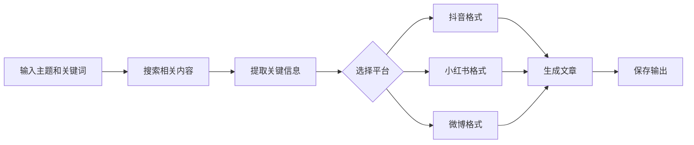

# 🍜 Noodle Create Writing - 自媒体文章生成技能

一个专门为美食（特别是面食）主题设计的自媒体文章生成技能。根据关键词自动搜索网页、汇总数据，生成适合抖音、小红书、微博平台的文章。

## 🎯 功能特点

### 核心功能
1. **智能搜索** - 使用Tavily API搜索最新、最相关的内容
2. **数据提取** - 从搜索结果中提取关键信息
3. **内容生成** - 根据平台特点生成不同风格的文章
4. **模板系统** - 提供各平台的文章模板

### 支持平台
- **抖音** - 简短、吸引眼球、话题标签丰富
- **小红书** - 详细、实用、配图建议
- **微博** - 热点敏感、互动性强

## 🚀 快速开始

### 1. 安装依赖
```bash
cd noodle-create-writing
npm install
```

### 2. 环境变量配置
需要设置Tavily API密钥：
```bash
export TAVILY_API_KEY="your_tavily_api_key"
```

### 3. 基本使用
```bash
# 生成关于"春天苏式面"的文章
node scripts/generate-article.js "春天里的苏式面" --keywords "浇头,吃法,时间,地点,好处,文化"

# 指定平台
node scripts/generate-article.js "主题" --platform douyin
node scripts/generate-article.js "主题" --platform xiaohongshu
node scripts/generate-article.js "主题" --platform weibo

# 多平台生成
node scripts/generate-article.js "主题" --platform all
```

## 📋 脚本说明

### `scripts/generate-article.js`
主脚本，完整的工作流程：
1. 搜索相关信息
2. 提取关键数据
3. 生成文章内容
4. 保存到文件

### `scripts/search-content.js`
搜索相关内容，支持：
- 关键词搜索
- 时间范围限制
- 深度搜索模式

### `scripts/extract-data.js`
从搜索结果中提取结构化数据：
- 关键信息点
- 统计数据
- 引用来源

### `scripts/format-article.js`
根据平台格式化文章：
- 抖音：15秒文案格式
- 小红书：详细教程格式
- 微博：热点讨论格式

## 🎨 文章模板

### 抖音模板 (`templates/douyin-template.md`)
- 15秒内可读完
- 使用热门话题标签
- 吸引眼球的标题
- 互动引导语

### 小红书模板 (`templates/xiaohongshu-template.md`)
- 详细步骤说明
- 实用技巧分享
- 配图建议
- 产品推荐

### 微博模板 (`templates/weibo-template.md`)
- 热点话题切入
- 数据支撑观点
- 互动问题设置
- 相关话题标签

## 📊 工作流程



## 🔧 高级选项

### 搜索参数
```bash
# 限制搜索结果数量
node scripts/generate-article.js "主题" --search-count 10

# 限制时间范围（天）
node scripts/generate-article.js "主题" --days 7

# 深度搜索模式
node scripts/generate-article.js "主题" --deep-search

# 指定搜索主题
node scripts/generate-article.js "主题" --topic news
```

### 输出控制
```bash
# 指定输出目录
node scripts/generate-article.js "主题" --output-dir ./articles

# 仅生成不保存
node scripts/generate-article.js "主题" --dry-run

# 显示详细过程
node scripts/generate-article.js "主题" --verbose
```

## 🍜 美食主题专用功能

### 面食相关关键词库
内置面食相关关键词，自动补充搜索：
- 浇头/配料
- 汤底/汤头
- 面条类型
- 吃法/习俗
- 季节限定
- 地方特色

### 文化内涵挖掘
自动挖掘美食背后的文化内涵：
- 历史渊源
- 地方习俗
- 季节时令
- 健康养生

## 📝 示例输出

### 抖音示例
```
🍜 春天必吃！苏式面这样吃才地道！

#春天美食 #苏式面 #苏州美食 #时令美食

👉 三虾面、枫镇大肉面、鲜笋面
👉 早上6-8点头汤面最鲜
👉 松鹤楼、朱鸿兴老字号推荐

关注我，解锁更多春天美食攻略！👇
```

### 小红书示例
```
#春天里的苏式面 #苏州美食攻略 #时令美食

春天来苏州，怎么能错过一碗地道的苏式面？作为苏州本地人，今天给大家分享春天吃苏式面的全攻略！

🍜 浇头推荐（春天限定）：
1. 三虾面 - 虾仁+虾脑+虾籽，鲜掉眉毛
2. 鲜笋面 - 春笋最嫩的时候
3. 香椿面 - 春天的味道

⏰ 最佳时间：早上6-8点，头汤面最鲜美

📍 老字号推荐：
• 松鹤楼 - 环境优雅，可听评弹
• 朱鸿兴 - 本地人最爱
• 裕面堂 - 精品苏式面

📸 拍照Tips：
• 拍汤面要体现"观音头、鲤鱼背"
• 浇头特写展示食材新鲜度
• 环境照体现苏式园林风格

💡 文化内涵：苏式面讲究"不时不食"，春天吃鲜，体现苏州人精致生活态度。

收藏这篇，春天去苏州不迷路！🌸
```

### 微博示例
```
#春天里的苏式面# #苏州美食# #时令饮食#

【春天吃苏式面，你吃对了吗？】

数据显示，苏州人春天最爱这三碗面：
1. 三虾面 - 虾肥籽饱的季节限定
2. 鲜笋面 - 春笋营养价值最高
3. 香椿面 - 只有春天才有的香气

文化内涵：苏式面体现苏州"不时不食"的饮食哲学，一碗面里藏着四季轮回。

🍜 投票：你春天最爱哪种苏式面？
A. 三虾面
B. 鲜笋面  
C. 香椿面
D. 其他

👉 转发+评论，抽3位送苏州老字号面馆代金券！

#美食文化# #传统美食# #饮食养生#
```

## 🔍 技术架构

### 依赖技能
- `tavily-search` - AI优化搜索
- `summarize` - 内容总结（可选）

### 文件结构
```
noodle-create-writing/
├── SKILL.md
├── package.json
├── scripts/
│   ├── generate-article.js
│   ├── search-content.js
│   ├── extract-data.js
│   └── format-article.js
├── templates/
│   ├── douyin-template.md
│   ├── xiaohongshu-template.md
│   └── weibo-template.md
├── keywords/
│   ├── noodle-keywords.json
│   └── culture-keywords.json
└── examples/
    ├── douyin-example.md
    ├── xiaohongshu-example.md
    └── weibo-example.md
```

## 🛠️ 故障排除

### 常见问题
1. **搜索无结果** - 检查API密钥，尝试简化关键词
2. **内容重复** - 使用`--deep-search`获取更多样化结果
3. **生成质量低** - 提供更具体的关键词，使用`--verbose`查看过程

### 性能优化
- 搜索结果缓存
- 并行处理多个关键词
- 增量更新已有内容

## 📈 未来计划

### 功能增强
- [ ] 支持图片生成建议
- [ ] 视频脚本生成
- [ ] 多语言支持
- [ ] 自动发布到平台API

### 主题扩展
- [ ] 其他美食类别
- [ ] 旅游攻略
- [ ] 生活技巧
- [ ] 健康养生

## 📚 相关资源

- [Tavily API文档](https://tavily.com)
- [OpenClaw技能开发指南](https://docs.openclaw.ai)
- [自媒体内容创作指南](https://weibo.com)

---

**开始创作你的第一篇美食自媒体文章吧！** 🍜✨