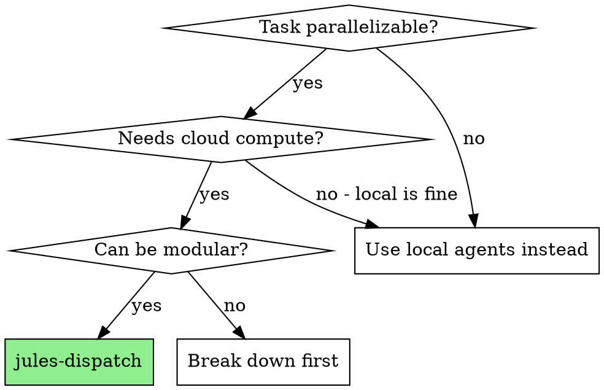
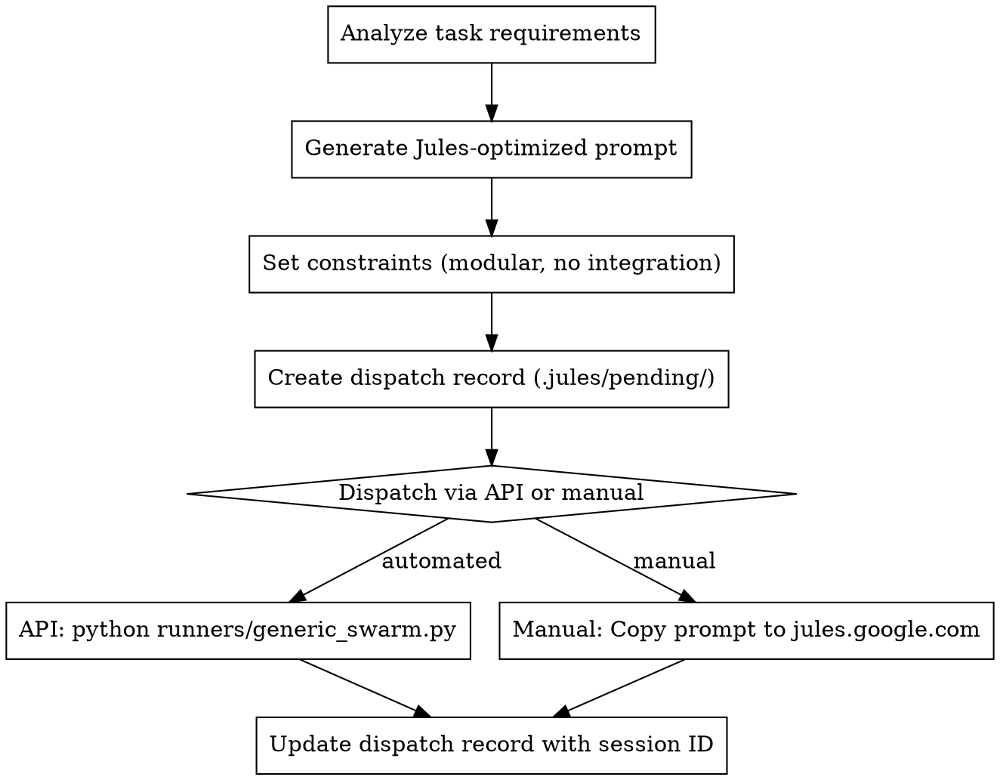

# Jules Dispatch

Prepare optimized task prompts and dispatch work to Jules for parallel cloud execution.

**Core principle:** Jules works best with modular, isolated tasks that don't require integration. Prepare prompts that maximize success rate and minimize manual cleanup.

## When to Use



**Ideal for:**
- Research and analysis tasks (compare repos, analyze patterns)
- Documentation generation (forge methodology, technical docs)
- Exploratory coding (prototypes, POCs, experiments)
- Test generation for existing code
- Refactoring proposals (modular, isolated)

**Avoid for:**
- Tightly integrated changes (needs local context)
- Real-time collaboration (async by nature)
- Quick fixes (overhead not worth it)

## The Process



## Prompt Template

Use this template for Jules tasks:

```markdown
# Task: [TITLE]

## Context
[Brief project context - what repo, what stage, what matters]

## Objective
[Clear, specific objective]

## Constraints
- Write modular code that doesn't require integration
- Place output in a new directory: `jules-output/[task-name]/`
- Do NOT modify existing project files
- Include comprehensive README explaining your work
- Include tests for any code produced

## Deliverables
1. [Specific deliverable 1]
2. [Specific deliverable 2]
3. README.md explaining approach and usage
4. Tests (if applicable)

## Success Criteria
- [ ] Output is self-contained in jules-output/
- [ ] README explains what was done
- [ ] Code is clean and documented
- [ ] Tests pass (if applicable)
```

## Dispatch Record Format

Create `.jules/pending/{task-id}.json`:

```json
{
  "id": "2025-01-17-auth-research",
  "title": "Research OAuth2 patterns",
  "prompt_file": ".jules/prompts/2025-01-17-auth-research.md",
  "dispatched_at": "2025-01-17T14:30:00Z",
  "session_id": null,
  "status": "pending",
  "account": "account-1@gmail.com",
  "repo": "user/project",
  "branch_pattern": "jules/auth-research-*",
  "expected_completion": "2025-01-17T16:00:00Z",
  "tags": ["research", "auth", "security"]
}
```

## Account Rotation Strategy

With 6 Pro accounts (15 concurrent × 100 daily each):

```
Account 1: Tasks 1-100 (day quota)
Account 2: Tasks 101-200
...
Account 6: Tasks 501-600

Within each account:
- Max 15 concurrent tasks
- Round-robin for load balancing
```

Track in `.jules/accounts.json`:
```json
{
  "accounts": [
    {"email": "acc1@gmail.com", "daily_used": 45, "concurrent": 12},
    {"email": "acc2@gmail.com", "daily_used": 23, "concurrent": 8}
  ],
  "last_reset": "2025-01-17T00:00:00Z"
}
```

## Best Practices

**Do:**
- Be extremely specific about deliverables
- Set modular output constraints
- Include success criteria checklist
- Track all dispatches with metadata
- Batch related tasks to same account

**Don't:**
- Ask Jules to integrate with existing code
- Dispatch without tracking
- Exceed account limits
- Forget output location constraints

## Example Workflow

```
You: I want to dispatch OAuth research to Jules

[Read project context]
[Generate optimized prompt using template]
[Create .jules/pending/2025-01-17-oauth-research.json]
[Save prompt to .jules/prompts/2025-01-17-oauth-research.md]

Options:
1. Automated: python runners/generic_swarm.py --task-file .jules/prompts/...
2. Manual: Copy prompt, paste at jules.google.com, record session ID

[Update dispatch record with session ID]
[Set reminder for expected completion]

Done! Use jules-harvest when branches are ready.
```

## Integration

**Next skill:** Use `Overpowers:jules-harvest` when Jules completes work
**Tracking:** All dispatches recorded in `.jules/pending/`
**Cleanup:** Move to `.jules/completed/` after harvest
