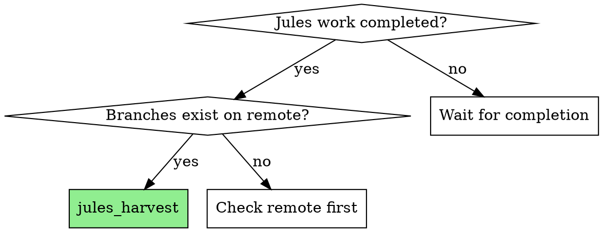
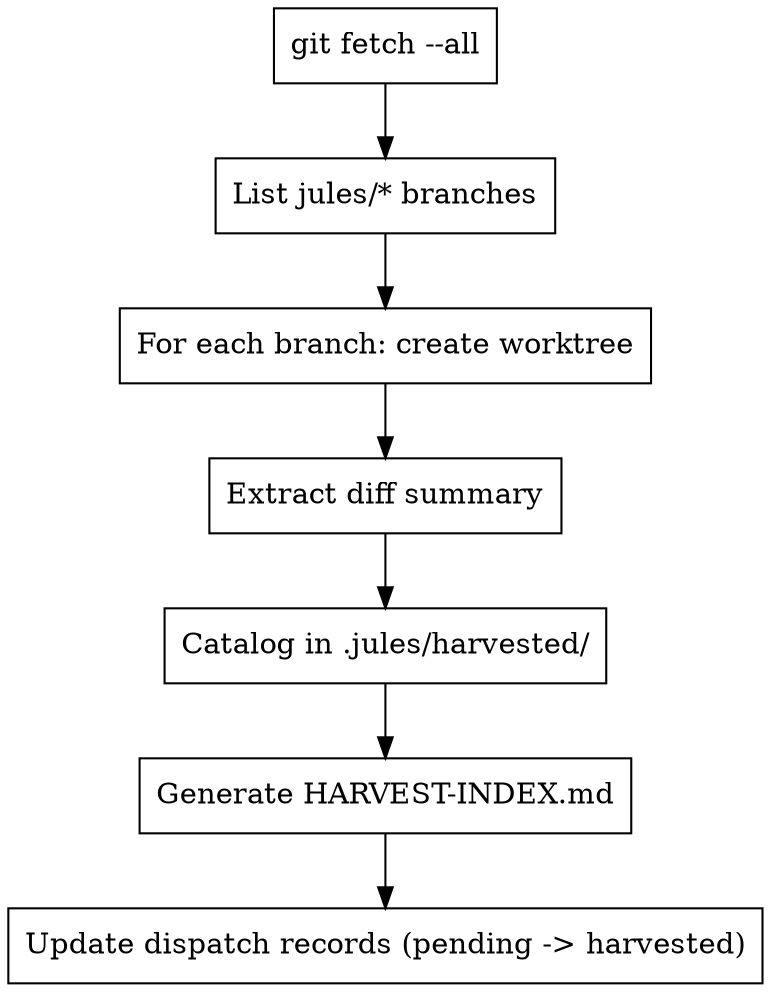

# Jules Harvest

Fetch completed Jules branches from GitHub and prepare them for local analysis.

**Core principle:** Jules delivers work as git branches. Harvest organizes them into worktrees for parallel analysis without polluting your main workspace.

## When to Use



## The Process



## Directory Structure

```
project/
├── .jules/
│   ├── pending/           # Dispatched, waiting
│   ├── harvested/         # Catalog of harvested branches
│   │   ├── {branch-name}.md
│   │   └── ...
│   ├── completed/         # Fully processed
│   └── HARVEST-INDEX.md   # Overview of all harvested work
├── branches/              # Git worktrees (gitignored)
│   ├── jules-oauth-research/
│   ├── jules-api-design/
│   └── ...
└── ...
```

## Harvest Commands

### Step 1: Fetch all branches
```bash
git fetch --all --prune
```

### Step 2: List Jules branches
```bash
git branch -r | grep 'origin/jules/' | sed 's|origin/||'
```

### Step 3: Create worktrees
```bash
# For each branch
git worktree add branches/{branch-name} origin/{branch-name}
```

### Step 4: Generate diff summary
```bash
# For each worktree
git log main..HEAD --oneline > .jules/harvested/{branch-name}-commits.txt
git diff main --stat > .jules/harvested/{branch-name}-stats.txt
```

## Harvest Record Format

Create `.jules/harvested/{branch-name}.md`:

```markdown
# Branch: jules/oauth-research

## Metadata
- **Dispatched:** 2025-01-17T14:30:00Z
- **Completed:** 2025-01-17T16:45:00Z  
- **Commits:** 8
- **Files Changed:** 12
- **Lines:** +847 / -23

## Commit Summary
1. feat: initial oauth research structure
2. docs: oauth2 flow documentation
3. feat: PKCE implementation example
4. test: oauth flow tests
...

## Files Changed
- jules-output/oauth-research/README.md (new)
- jules-output/oauth-research/src/oauth.ts (new)
- jules-output/oauth-research/tests/oauth.test.ts (new)
...

## Quick Assessment
- [ ] Has README
- [ ] Has tests
- [ ] Code compiles
- [ ] Follows conventions

## Worktree Path
`branches/jules-oauth-research/`

## Status
🟡 **Pending Triage** - Ready for jules_triage analysis
```

## HARVEST-INDEX.md Format

```markdown
# Jules Harvest Index

*Last updated: 2025-01-17T17:00:00Z*

## Summary
- **Total Branches:** 15
- **Pending Triage:** 12
- **Triaged:** 3
- **Integrated:** 0

## Branches by Status

### 🟡 Pending Triage (12)

| Branch | Dispatched | Files | Lines | Quick Look |
|--------|-----------|-------|-------|------------|
| jules/oauth-research | 2025-01-17 | 12 | +847 | OAuth2 implementation |
| jules/api-design | 2025-01-17 | 8 | +523 | REST API patterns |
| ... | ... | ... | ... | ... |

### 🔵 Triaged (3)

| Branch | Assessment | Recommendation |
|--------|-----------|----------------|
| jules/auth-middleware | ✅ High value | Merge with adaptations |
| jules/logging-util | 🔧 Needs work | Extract patterns only |
| jules/dead-code | ❌ Low value | Discard |

### ✅ Integrated (0)

(None yet)
```

## Automation Script

Create `scripts/jules_harvest.sh`:

```bash
#!/bin/bash
# Jules Harvest Script

set -e

BRANCHES_DIR="branches"
JULES_DIR=".jules"
HARVESTED_DIR="$JULES_DIR/harvested"

# Ensure directories exist
mkdir -p "$BRANCHES_DIR" "$HARVESTED_DIR"

# Fetch all
echo "📥 Fetching all branches..."
git fetch --all --prune

# Get Jules branches
JULES_BRANCHES=$(git branch -r | grep 'origin/jules/' | sed 's|origin/||' | tr -d ' ')

if [ -z "$JULES_BRANCHES" ]; then
    echo "No Jules branches found."
    exit 0
fi

echo "Found $(echo "$JULES_BRANCHES" | wc -l) Jules branches"

# Process each branch
for BRANCH in $JULES_BRANCHES; do
    SAFE_NAME=$(echo "$BRANCH" | tr '/' '-')
    WORKTREE_PATH="$BRANCHES_DIR/$SAFE_NAME"
    
    if [ -d "$WORKTREE_PATH" ]; then
        echo "⏭️  Skipping $BRANCH (already harvested)"
        continue
    fi
    
    echo "🌾 Harvesting $BRANCH..."
    
    # Create worktree
    git worktree add "$WORKTREE_PATH" "origin/$BRANCH" 2>/dev/null || continue
    
    # Generate catalog entry
    COMMITS=$(git -C "$WORKTREE_PATH" log main..HEAD --oneline 2>/dev/null | wc -l || echo "?")
    STATS=$(git -C "$WORKTREE_PATH" diff main --stat 2>/dev/null | tail -1 || echo "unknown")
    
    cat > "$HARVESTED_DIR/$SAFE_NAME.md" << EOF
# Branch: $BRANCH

## Metadata
- **Harvested:** $(date -Iseconds)
- **Commits:** $COMMITS
- **Stats:** $STATS

## Worktree Path
\`$WORKTREE_PATH/\`

## Status
🟡 **Pending Triage**
EOF
    
    echo "  ✅ Created worktree and catalog entry"
done

echo ""
echo "✅ Harvest complete! Run jules_triage to analyze."
```

## Best Practices

**Do:**
- Add `branches/` to `.gitignore`
- Keep `.jules/` tracked (metadata is valuable)
- Run harvest before triage
- Prune regularly after integration

**Don't:**
- Commit worktree contents to main
- Delete worktrees before full integration
- Lose dispatch metadata

## Integration

**Previous skill:** `overpowers:jules-dispatch` (how branches got created)
**Next skill:** `overpowers:jules-triage` (analyze harvested branches)
**Cleanup:** After integrate, remove worktrees with `git worktree remove`
