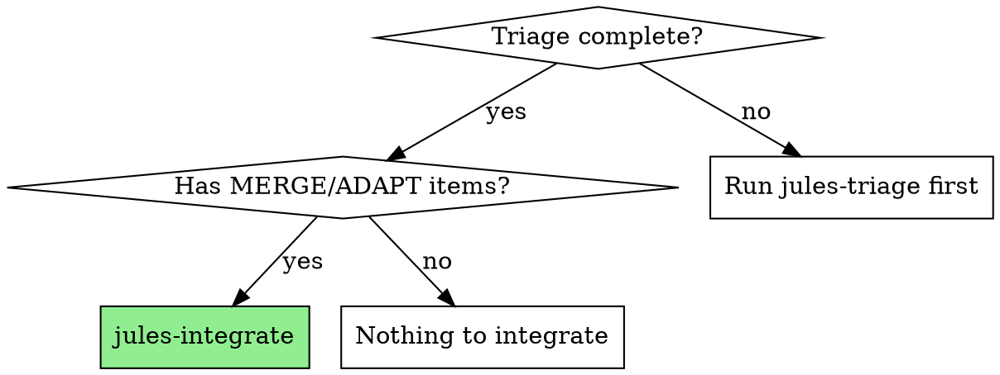
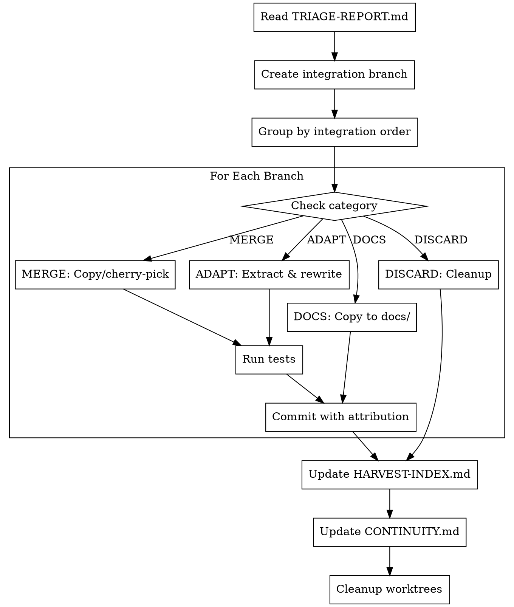

# Jules Integrate

Selectively integrate valuable work from Jules branches based on triage recommendations.

**Core principle:** Integration should be surgical - cherry-pick value, adapt to conventions, verify at each step. Never bulk-merge without understanding.

## When to Use



## Integration Categories

Based on triage, handle each category differently:

### ✅ MERGE (High Value, Low Friction)
Direct integration with minimal changes:
1. Create feature branch
2. Cherry-pick or copy files
3. Adapt imports/paths
4. Run tests
5. Commit with attribution

### 🔧 ADAPT (High Value, Needs Work)
Extract patterns and adapt:
1. Identify valuable components
2. Rewrite following project conventions
3. Test integration points
4. Document origin

### 📝 DOCS-ONLY
Copy to documentation:
1. Extract docs/diagrams/plans
2. Place in appropriate docs location
3. Update indexes

### ❌ DISCARD
Clean up:
1. Remove worktree
2. Delete remote branch
3. Archive dispatch record

## The Process



## Integration Workflows

### MERGE Workflow

```bash
# 1. Create integration branch
git checkout -b integrate/jules-oauth-middleware

# 2. Copy files from worktree
cp -r branches/jules-oauth-middleware/jules-output/oauth/* src/middleware/oauth/

# 3. Adapt imports
# (Manual or scripted path adjustments)

# 4. Run tests
npm test

# 5. Commit with attribution
git add .
git commit -m "feat(auth): integrate OAuth middleware from Jules

Source: jules/oauth-middleware branch
Original author: Jules AI
Adapted by: [your name]

- Added PKCE flow support
- Integrated with existing session management
- Added comprehensive tests

Co-authored-by: Jules <jules@google.com>"

# 6. Open PR or merge
```

### ADAPT Workflow

```markdown
# Adaptation Process

## Source: jules/auth-flow

### What to Extract
1. Token refresh logic (src/auth/refresh.ts)
2. Session timeout handling pattern

### Adaptation Needed
- Change from Redis to our Postgres session store
- Align with existing auth middleware
- Use our logging format

### Resulting Files
- src/auth/token-refresh.ts (new)
- src/middleware/session-timeout.ts (modified)

### Tests
- tests/auth/token-refresh.test.ts
```

```typescript
// Example: Adapted from Jules with our conventions
// Original: jules/auth-flow/src/refresh.ts
// Adapted for Postgres session store

import { db } from '@/lib/db'  // Our import style
import { logger } from '@/lib/logger'  // Our logger

export async function refreshToken(sessionId: string): Promise<Token> {
  // Logic adapted from Jules implementation
  // but using our Postgres session store instead of Redis
  const session = await db.session.findUnique({ where: { id: sessionId } })
  // ...
}
```

### DOCS-ONLY Workflow

```bash
# 1. Identify doc files in worktree
ls branches/jules-architecture-proposal/jules-output/docs/

# 2. Copy to project docs
cp -r branches/jules-architecture-proposal/jules-output/docs/* docs/proposals/jules-architecture/

# 3. Add index entry
echo "- [Jules Architecture Proposal](./jules-architecture/)" >> docs/proposals/README.md

# 4. Commit
git add docs/
git commit -m "docs: add architecture proposal from Jules

Source: jules/architecture-proposal branch"
```

### DISCARD Workflow

```bash
# 1. Remove worktree
git worktree remove branches/jules-experimental-feature

# 2. Delete remote branch
git push origin --delete jules/experimental-feature

# 3. Archive dispatch record
mv .jules/harvested/jules-experimental-feature.md .jules/archived/
```

## Attribution Best Practices

Always credit Jules in commits:

```
feat(component): brief description

Source: jules/{branch-name}
Original work by Jules AI
Integrated/adapted by: [your name]

[Detailed description of what was taken and any adaptations]

Co-authored-by: Jules <jules@google.com>
```

## Post-Integration Checklist

After integrating each branch:

- [ ] Tests pass
- [ ] No linting errors
- [ ] Documentation updated if needed
- [ ] HARVEST-INDEX.md updated (status → ✅ Integrated)
- [ ] Worktree can be removed
- [ ] Remote branch can be deleted (optional, keep for reference)

## CONTINUITY.md Update

After integration session, update project continuity:

```markdown
## Recent Integrations

### 2025-01-17: Jules Batch Integration

Integrated 8 branches from Jules:
- ✅ oauth-middleware → src/middleware/oauth/
- ✅ api-validation → src/schemas/
- 🔧 auth-flow → src/auth/token-refresh.ts (adapted)
- 📝 architecture-proposal → docs/proposals/

Remaining: 4 branches pending, 3 discarded

See `.jules/HARVEST-INDEX.md` for full details.
```

## Integration Order Strategy

Process branches in dependency order to minimize conflicts:

1. **Foundation** - Error handling, utilities, types
2. **Infrastructure** - Database, caching, logging
3. **Features** - Auth, API endpoints, business logic
4. **Polish** - Docs, tests, tooling

## Red Flags During Integration

**Stop and reassess if:**
- Tests fail after integration
- Conflicts with recent main changes
- Performance degradation detected
- Security concerns emerge
- Architecture violations

## Cleanup Script

After all integrations complete:

```bash
#!/bin/bash
# jules-cleanup.sh

# Remove all worktrees for integrated branches
for branch in $(cat .jules/integrated-branches.txt); do
    git worktree remove "branches/$branch" 2>/dev/null
done

# Optionally delete remote branches
# git push origin --delete $(cat .jules/integrated-branches.txt | sed 's/^/jules\//')

# Archive completed records
mv .jules/harvested/*.md .jules/archived/

echo "✅ Cleanup complete"
```

## Integration

**Previous skill:** `Overpowers:jules-triage` (produces integration plan)
**Related:** `Overpowers:finishing-a-development-branch` (finalize integration PR)
**Tracking:** Update `.jules/HARVEST-INDEX.md` and `CONTINUITY.md`
