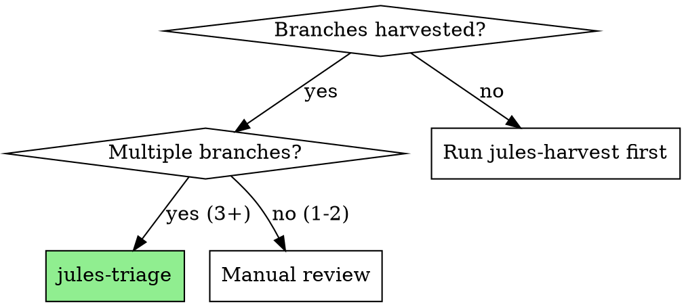
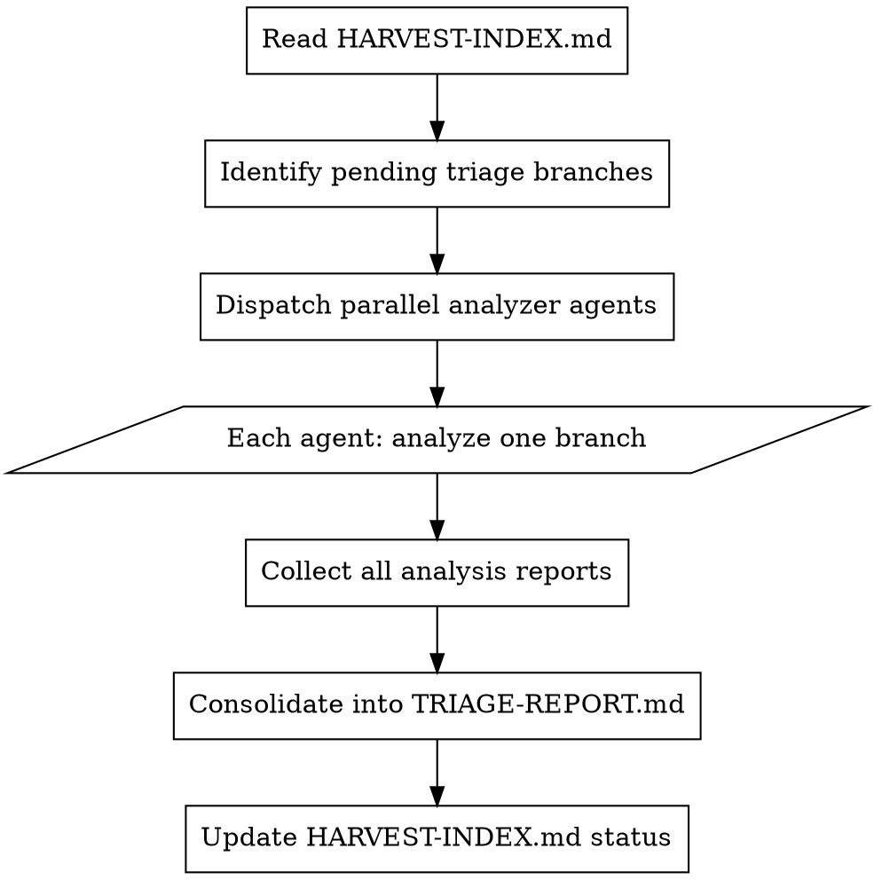

# Jules Triage

Analyze harvested Jules branches in parallel using local agents to assess value and determine integration strategy.

**Core principle:** With potentially dozens of branches, sequential analysis is too slow. Dispatch parallel workers to analyze each branch independently, then consolidate findings.

## When to Use



## The Process



## Parallel Analysis with Swarm

Use swarm-plugin for coordinated parallel analysis:

```
/swarm "Triage all pending Jules branches in branches/"
```

Or dispatch manually with `dispatching-parallel-agents`:

```typescript
// Dispatch one agent per branch
Task("Analyze branches/jules-oauth-research - assess value, conflicts, integration strategy")
Task("Analyze branches/jules-api-design - assess value, conflicts, integration strategy")
Task("Analyze branches/jules-logging - assess value, conflicts, integration strategy")
// All run in parallel
```

## Branch Analyzer Prompt

For each branch, the analyzer agent uses this template:

```markdown
# Analyze Jules Branch: {branch-name}

## Your Task
Analyze the work in `{worktree-path}/` and produce an assessment.

## Analysis Checklist

### 1. Code Quality (1-10)
- [ ] Code compiles/runs
- [ ] Follows project conventions
- [ ] Has adequate comments
- [ ] Error handling present
- [ ] No obvious bugs

### 2. Value Assessment
- [ ] Solves intended problem
- [ ] Novel approach (vs existing code)
- [ ] Reusable components
- [ ] Good documentation

### 3. Integration Complexity
- [ ] Self-contained (easy)
- [ ] Minor adaptations needed (medium)
- [ ] Major refactoring required (hard)
- [ ] Conflicts with existing code (very hard)

### 4. Conflict Detection
Check for conflicts with:
- Existing file paths
- Naming conventions
- Architecture patterns
- Dependencies

## Output Format

Produce `.jules/triage/{branch-name}.md`:

```markdown
# Triage: {branch-name}

## Recommendation
[✅ MERGE | 🔧 ADAPT | 📝 DOCS-ONLY | ❌ DISCARD]

## Scores
- Code Quality: X/10
- Value: X/10  
- Integration Ease: X/10

## Summary
[2-3 sentence summary of what this branch does]

## Valuable Components
1. [Component 1] - [why valuable]
2. [Component 2] - [why valuable]

## Integration Notes
[Specific notes on how to integrate, conflicts to resolve, adaptations needed]

## Conflicts Detected
- [File/pattern conflict 1]
- [File/pattern conflict 2]

## Action Items
- [ ] [Specific action 1]
- [ ] [Specific action 2]
```
```

## TRIAGE-REPORT.md Format

After all branches analyzed, consolidate:

```markdown
# Jules Triage Report

*Generated: 2025-01-17T18:00:00Z*
*Branches Analyzed: 15*

## Quick Summary

| Recommendation | Count | Action |
|---------------|-------|--------|
| ✅ MERGE | 3 | Ready for jules-integrate |
| 🔧 ADAPT | 5 | Extract valuable parts |
| 📝 DOCS-ONLY | 4 | Copy documentation/plans |
| ❌ DISCARD | 3 | Can delete branches |

## ✅ Ready to Merge (3)

### jules/oauth-middleware
- **Quality:** 9/10 | **Value:** 9/10 | **Ease:** 8/10
- **Summary:** Complete OAuth2 middleware with PKCE, tests, docs
- **Action:** Merge to `src/middleware/`, update imports

### jules/api-validation
- **Quality:** 8/10 | **Value:** 8/10 | **Ease:** 9/10
- **Summary:** Zod schemas for all API endpoints
- **Action:** Merge to `src/schemas/`, add to validation layer

### jules/error-handling
- **Quality:** 8/10 | **Value:** 9/10 | **Ease:** 7/10
- **Summary:** Centralized error handling with logging
- **Action:** Merge with adaptations to existing error patterns

## 🔧 Needs Adaptation (5)

### jules/auth-flow
- **Quality:** 7/10 | **Value:** 8/10 | **Ease:** 5/10
- **Summary:** Good concepts but wrong abstraction layer
- **Extract:** Auth token refresh logic, session management patterns
- **Conflicts:** Uses different session store than project

### jules/database-migrations
...

## 📝 Documentation/Plans Only (4)

### jules/architecture-proposal
- **Value:** High for planning
- **Extract:** Architecture diagrams, decision rationale
- **Destination:** `docs/proposals/`

### jules/testing-strategy
...

## ❌ Discard (3)

### jules/experimental-feature
- **Reason:** Doesn't align with current roadmap
- **Action:** Delete branch after confirming

### jules/duplicate-auth
- **Reason:** Superseded by jules/oauth-middleware
- **Action:** Delete branch

...

## Integration Order

Recommended sequence to minimize conflicts:

1. jules/error-handling (foundation)
2. jules/api-validation (depends on error handling)
3. jules/oauth-middleware (uses both)
...

## Estimated Effort

| Category | Branches | Est. Hours |
|----------|----------|-----------|
| ✅ MERGE | 3 | 2h |
| 🔧 ADAPT | 5 | 8h |
| 📝 DOCS | 4 | 1h |
| ❌ DELETE | 3 | 0.5h |
| **Total** | **15** | **11.5h** |
```

## Red Flags

**Stop and escalate if:**
- Multiple branches modify same files
- Branch introduces breaking dependency changes
- Security concerns in code
- License issues in copied code

## Integration

**Previous skill:** `Overpowers:jules-harvest` (creates worktrees)
**Next skill:** `Overpowers:jules-integrate` (acts on triage recommendations)
**Uses:** `Overpowers:dispatching-parallel-agents` or `swarm-plugin` for parallel analysis
