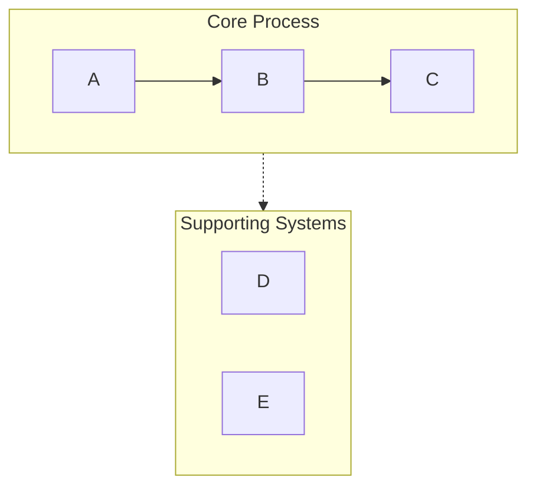
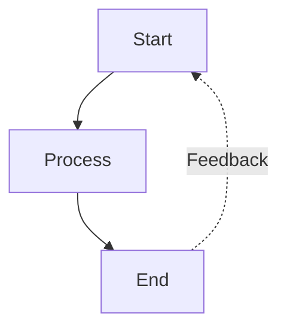
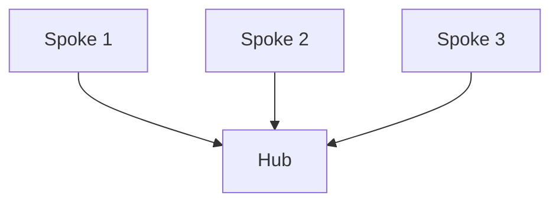

# Mermaid Visualizer

## Overview

Convert text content into clean, professional Mermaid diagrams optimized for presentations and documentation. Automatically handles common syntax pitfalls (list syntax conflicts, subgraph naming, spacing issues) to ensure diagrams render correctly in Obsidian, GitHub, and other Mermaid-compatible platforms.

## Quick Start

When creating a Mermaid diagram:

1. **Analyze the content** - Identify key concepts, relationships, and flow
2. **Choose diagram type** - Select the most appropriate visualization (see Diagram Types below)
3. **Select configuration** - Determine layout, detail level, and styling
4. **Generate diagram** - Create syntactically correct Mermaid code
5. **Output in markdown** - Wrap in proper code fence with optional explanation

**Default assumptions:**
- Vertical layout (TB) unless horizontal requested
- Medium detail level (balanced between simplicity and information)
- Professional color scheme with semantic colors
- Obsidian/GitHub compatible syntax

## Diagram Types

### 1. Process Flow (graph TB/LR)
**Best for:** Workflows, decision trees, sequential processes, AI agent architectures

**Use when:** Content describes steps, stages, or a sequence of actions

**Key features:**
- Swimlanes via subgraph for grouping related steps
- Arrow labels for transitions
- Feedback loops and branches
- Color-coded stages

**Configuration options:**
- `layout`: "vertical" (TB), "horizontal" (LR)
- `detail`: "simple" (core steps only), "standard" (with descriptions), "detailed" (with annotations)
- `style`: "minimal", "professional", "colorful"

### 2. Circular Flow (graph TD with circular layout)
**Best for:** Cyclic processes, continuous improvement loops, agent feedback systems

**Use when:** Content emphasizes iteration, feedback, or circular relationships

**Key features:**
- Central hub with radiating elements
- Curved feedback arrows
- Clear cycle indicators

### 3. Comparison Diagram (graph TB with parallel paths)
**Best for:** Before/after comparisons, A vs B analysis, traditional vs modern systems

**Use when:** Content contrasts two or more approaches or systems

**Key features:**
- Side-by-side layout
- Central comparison node
- Clear differentiation via color/style

### 4. Mindmap
**Best for:** Hierarchical concepts, knowledge organization, topic breakdowns

**Use when:** Content is hierarchical with clear parent-child relationships

**Key features:**
- Radial tree structure
- Multiple levels of nesting
- Clean visual hierarchy

### 5. Sequence Diagram
**Best for:** Interactions between components, API calls, message flows

**Use when:** Content involves communication between actors/systems over time

**Key features:**
- Timeline-based layout
- Clear actor separation
- Activation boxes for processes

### 6. State Diagram
**Best for:** System states, status transitions, lifecycle stages

**Use when:** Content describes states and transitions between them

**Key features:**
- Clear state nodes
- Labeled transitions
- Start and end states

## Critical Syntax Rules

**Always follow these rules to prevent parsing errors:**

### Rule 1: Avoid List Syntax Conflicts
```
❌ WRONG: [1. Perception]       → Triggers "Unsupported markdown: list"
✅ RIGHT: [1.Perception]         → Remove space after period
✅ RIGHT: [① Perception]         → Use circled numbers (①②③④⑤⑥⑦⑧⑨⑩)
✅ RIGHT: [(1) Perception]       → Use parentheses
✅ RIGHT: [Step 1: Perception]   → Use "Step" prefix
```

### Rule 2: Subgraph Naming
```
❌ WRONG: subgraph AI Agent Core  → Space in name without quotes
✅ RIGHT: subgraph agent["AI Agent Core"]  → Use ID with display name
✅ RIGHT: subgraph agent          → Use simple ID only
```

### Rule 3: Node References
```
❌ WRONG: Title --> AI Agent Core  → Reference display name directly
✅ RIGHT: Title --> agent          → Reference subgraph ID
```

### Rule 4: Special Characters in Node Text
```
✅ Use quotes for text with spaces: ["Text with spaces"]
✅ Escape or avoid: quotation marks → use 『』instead
✅ Escape or avoid: parentheses → use 「」instead
✅ Line breaks in circle nodes only: ((Text<br/>Break))
```

### Rule 5: Arrow Types
- `-->` solid arrow
- `-.->` dashed arrow (for supporting systems, optional paths)
- `==>` thick arrow (for emphasis)
- `~~~` invisible link (for layout only)

For complete syntax reference and edge cases, see [references/syntax-rules.md](references/syntax-rules.md)

## Configuration Options

All diagrams accept these parameters:

**Layout:**
- `direction`: "vertical" (TB), "horizontal" (LR), "right-to-left" (RL), "bottom-to-top" (BT)
- `aspect`: "portrait" (default), "landscape" (wide), "square"

**Detail Level:**
- `simple`: Core elements only, minimal labels
- `standard`: Balanced detail with key descriptions (default)
- `detailed`: Full annotations, explanations, and metadata
- `presentation`: Optimized for slides (larger text, fewer details)

**Style:**
- `minimal`: Monochrome, clean lines
- `professional`: Semantic colors, clear hierarchy (default)
- `colorful`: Vibrant colors, high contrast
- `academic`: Formal styling for papers/documentation

**Additional Options:**
- `show_legend`: true/false - Include color/symbol legend
- `numbered`: true/false - Add sequence numbers to steps
- `title`: string - Add diagram title

## Example Usage Patterns

**Pattern 1: Basic request**
```
User: "Visualize the software development lifecycle"
Response: [Analyze → Choose graph TB → Generate with standard detail]
```

**Pattern 2: With configuration**
```
User: "Create a horizontal flowchart of our sales process with lots of detail"
Response: [Analyze → Choose graph LR → Generate with detailed level]
```

**Pattern 3: Comparison**
```
User: "Compare traditional AI vs AI agents"
Response: [Analyze → Choose comparison layout → Generate with contrasting styles]
```

## Workflow

1. **Understand the content**
   - Identify main concepts, entities, and relationships
   - Determine hierarchy or sequence
   - Note any comparisons or contrasts

2. **Select diagram type**
   - Match content structure to diagram type
   - Consider user's presentation context
   - Default to process flow if ambiguous

3. **Choose configuration**
   - Apply user-specified options
   - Use sensible defaults for unspecified options
   - Optimize for readability

4. **Generate Mermaid code**
   - Follow all syntax rules strictly
   - Use semantic naming (descriptive IDs)
   - Apply consistent styling
   - Test for common errors:
     * No "number. space" patterns in node text
     * All subgraphs use ID["display name"] format
     * All node references use IDs not display names

5. **Output with context**
   - Wrap in ```mermaid code fence
   - Add brief explanation of diagram structure
   - Mention rendering compatibility (Obsidian, GitHub, etc.)
   - Offer to adjust or create variations

## Color Scheme Defaults

Standard professional palette:
- Green (#d3f9d8/#2f9e44): Input, perception, start states
- Red (#ffe3e3/#c92a2a): Planning, decision points
- Purple (#e5dbff/#5f3dc4): Processing, reasoning
- Orange (#ffe8cc/#d9480f): Actions, tool usage
- Cyan (#c5f6fa/#0c8599): Output, execution, results
- Yellow (#fff4e6/#e67700): Storage, memory, data
- Pink (#f3d9fa/#862e9c): Learning, optimization
- Blue (#e7f5ff/#1971c2): Metadata, definitions, titles
- Gray (#f8f9fa/#868e96): Neutral elements, traditional systems

## Common Patterns

### Swimlane Pattern (Grouping)


### Feedback Loop Pattern


### Hub and Spoke Pattern


## Quality Checklist

Before outputting, verify:
- [ ] No "number. space" patterns in any node text
- [ ] All subgraphs use proper ID syntax
- [ ] All arrows use correct syntax (-->, -.->)
- [ ] Colors applied consistently
- [ ] Layout direction specified
- [ ] Style declarations present
- [ ] No ambiguous node references
- [ ] Compatible with Obsidian/GitHub renderers
- [ ] **No Emoji** in any node text - use text labels or color coding instead

## References

For detailed syntax rules and troubleshooting, see:
- [references/syntax-rules.md](references/syntax-rules.md) - Complete syntax reference and error prevention
