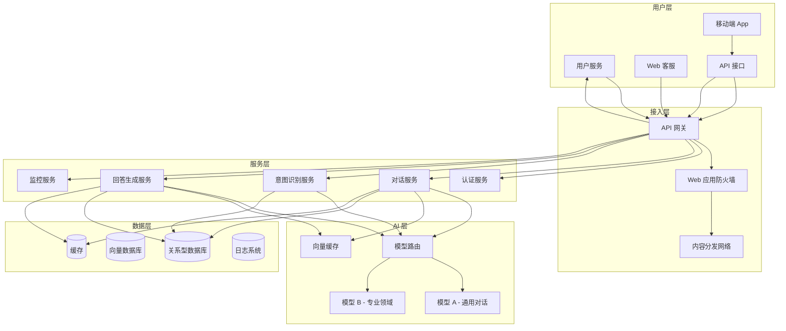
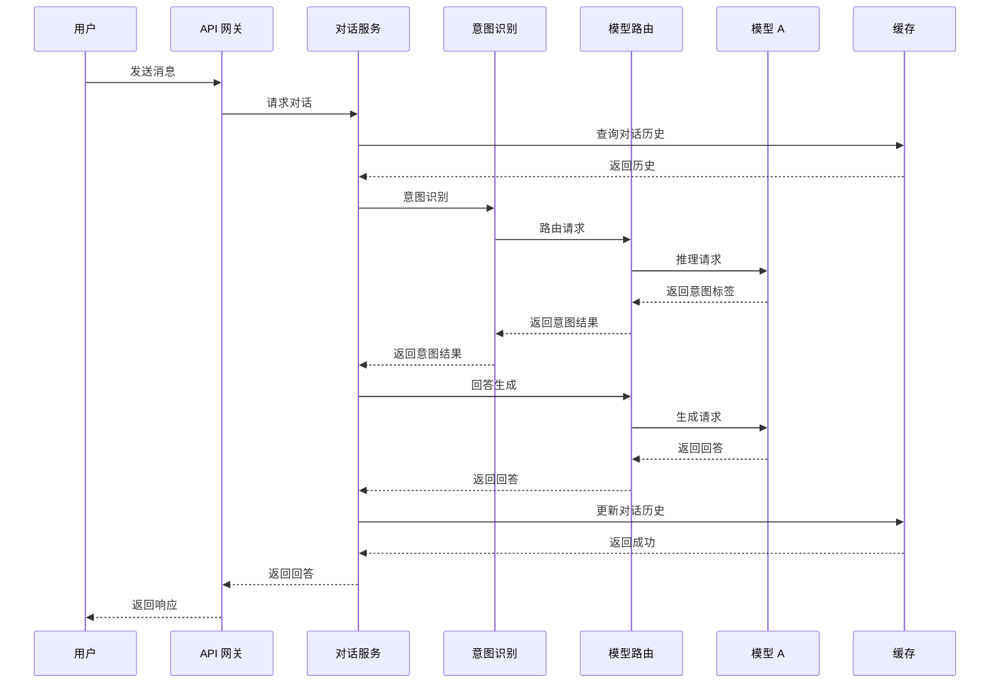
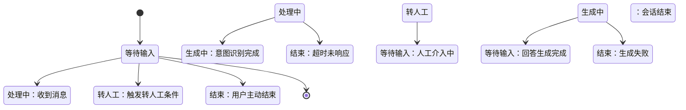
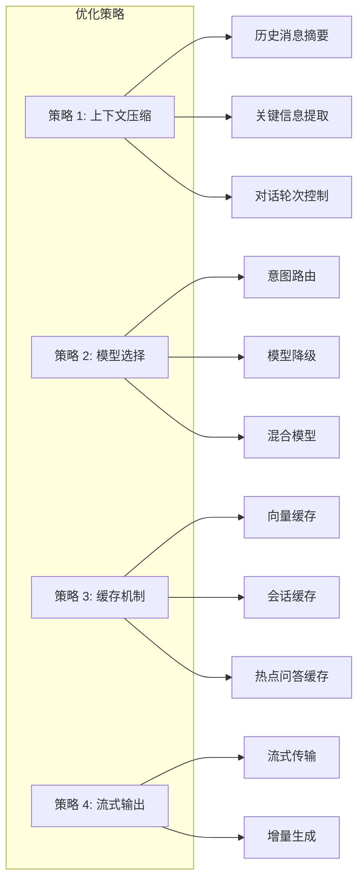

# AI 智能客服系统 - 产品需求文档 (PRD)

---

## 1. 文档信息

| 项目 | 内容 |
|------|------|
| 文档版本 | v1.0 |
| 创建日期 | 2024-01-15 |
| 最后更新 | 2024-01-15 |
| 文档状态 | 待评审 |
| 负责人 | 产品经理 |

---

## 2. 项目背景与目标

### 2.1 项目背景

当前客服系统存在以下核心问题：
- **响应时间过长**：平均响应时间超过 3 秒，严重影响用户体验
- **Token 消耗超标**：每日 Token 消耗超出预算 20%，成本不可控
- **用户满意度低**：好评率低于 80%，客户投诉增多

### 2.2 项目目标

| 目标 | 指标 | 时间节点 |
|------|------|----------|
| 性能优化 | 响应时间 < 2s | 上线后 1 周 |
| 成本控制 | Token 消耗降低 30% | 上线后 1 个月 |
| 体验提升 | 用户满意度 > 90% | 上线后 1 个月 |

---

## 3. 用户故事

### 3.1 核心用户故事

```markdown
### 故事 1：用户快速提问
**作为** 客服用户
**我想要** 在 2 秒内获得 AI 回答
**以便于** 提高沟通效率，减少等待焦虑

### 故事 2：多轮对话支持
**作为** 客服用户
**我想要** 进行多轮上下文对话
**以便于** 获得连贯、准确的问题解答

### 故事 3：智能意图识别
**作为** 客服用户
**我想要** 系统自动识别问题类型
**以便于** 获得针对性的解决方案

### 故事 4：人工介入机制
**作为** 客服用户
**我想要** 复杂问题可转人工
**以便于** 获得专业支持
```

### 3.2 用户角色

| 角色 | 描述 | 使用频率 |
|------|------|---------|
| 普通用户 | 日常咨询、问题解答 | 高频 |
| 技术支持 | 技术故障、功能咨询 | 中频 |
| 销售顾问 | 产品咨询、报价支持 | 中频 |
| 客服主管 | 团队管理、数据分析 | 低频 |

---

## 4. 功能需求

### 4.1 核心功能列表

| 功能模块 | 功能点 | 优先级 | 描述 |
|---------|--------|--------|------|
| **对话管理** | 多轮对话 | Must | 支持上下文记忆，保持对话连贯性 |
| | 对话历史 | Must | 保存最近 20 条对话记录 |
| | 对话重置 | Must | 用户可随时清除上下文 |
| **智能识别** | 意图识别 | Must | 识别用户问题类型（咨询/投诉/技术/其他） |
| | 情感分析 | Should | 识别用户情绪状态 |
| | 关键词提取 | Should | 提取问题中的关键信息 |
| **内容生成** | 智能回答 | Must | 基于 AI 模型生成回答 |
| | 回答长度控制 | Must | 根据问题类型控制回答长度 |
| | 多语言支持 | Should | 支持中英文切换 |
| **人工介入** | 转人工入口 | Must | 提供一键转人工按钮 |
| | 人工客服分配 | Should | 智能分配人工客服 |
| | 对话记录同步 | Should | 转人工后记录完整 |
| **管理功能** | 对话统计 | Must | 每日对话量、满意度统计 |
| | 热点问题分析 | Should | 识别高频问题 |
| | 回答质量监控 | Should | 抽查 AI 回答质量 |

### 4.2 功能详细设计

#### 4.2.1 对话管理

**输入**：
- 用户消息文本
- 对话历史（最多 20 条）
- 用户身份标识

**处理**：
- 消息去重与过滤
- 上下文窗口管理（动态调整）
- 敏感词过滤
- 对话状态维护

**输出**：
- AI 回答文本
- 回答置信度评分
- 是否需要人工介入标识

**验收标准**：
- ✅ 响应时间 < 2 秒（95% 请求）
- ✅ 支持最多 50 轮对话历史
- ✅ 对话重置后上下文清空

#### 4.2.2 智能识别

**输入**：
- 用户消息文本
- 用户历史行为数据

**处理**：
- 意图分类模型推理
- 情感分析模型推理
- 关键词匹配
- 优先级排序

**输出**：
- 意图标签（咨询/投诉/技术/销售/其他）
- 情感得分（-1 到 1）
- 问题紧急度等级

**验收标准**：
- ✅ 意图识别准确率 > 85%
- ✅ 情感分析准确率 > 80%
- ✅ 识别延迟 < 500ms

#### 4.2.3 内容生成

**输入**：
- 用户问题
- 识别的意图标签
- 对话上下文
- 预设回答模板

**处理**：
- 意图路由（选择对应模型）
- Prompt 模板填充
- 回答生成
- 长度控制与优化

**输出**：
- AI 回答文本
- Token 使用量
- 生成耗时

**验收标准**：
- ✅ Token 消耗 < 500 tokens/对话
- ✅ 回答长度符合预期（咨询<500 字，投诉<1000 字）
- ✅ 生成延迟 < 1.5 秒

#### 4.2.4 人工介入

**输入**：
- 对话上下文
- 用户情绪状态
- 问题复杂度评估

**处理**：
- 转人工条件判断
- 客服分配逻辑
- 记录同步

**输出**：
- 转人工建议
- 分配客服信息

**验收标准**：
- ✅ 转人工成功率 > 95%
- ✅ 人工介入响应时间 < 30 秒

---

## 5. 非功能性需求

### 5.1 性能需求

| 指标 | 目标值 | 测试方法 |
|------|--------|----------|
| 首字响应时间 | < 500ms | 95 分位 |
| 完整响应时间 | < 2000ms | 95 分位 |
| 并发处理能力 | 1000 QPS | 压力测试 |
| 系统可用性 | 99.9% | 月度统计 |

### 5.2 可靠性需求

| 指标 | 目标值 |
|------|--------|
| 数据持久性 | 强一致性 |
| 故障恢复时间 | < 5 分钟 |
| 数据备份频率 | 每小时 |
| 容灾能力 | RTO < 1 小时，RPO < 5 分钟 |

### 5.3 安全性需求

| 需求项 | 要求 |
|--------|------|
| 数据加密 | 传输层 TLS 1.3，存储 AES-256 |
| 身份认证 | OAuth 2.0 + JWT |
| 权限控制 | RBAC 模型 |
| 隐私保护 | 敏感信息脱敏 |
| 合规要求 | 符合 GDPR 及本地法规 |

### 5.4 可扩展性需求

| 维度 | 要求 |
|------|------|
| 水平扩展 | 支持无状态扩缩容 |
| 模型支持 | 支持多模型热切换 |
| 接口标准化 | RESTful + GraphQL |
| 插件机制 | 支持功能模块热插拔 |

---

## 6. 系统架构

### 6.1 整体架构图



### 6.2 对话服务时序图



### 6.3 对话状态机



---

## 7. 数据模型

### 7.1 核心数据表

```sql
-- 对话记录表
CREATE TABLE conversations (
    id BIGINT PRIMARY KEY AUTO_INCREMENT,
    user_id BIGINT NOT NULL,
    session_id VARCHAR(64) NOT NULL,
    status TINYINT DEFAULT 0, -- 0:进行中 1:已结束
    created_at TIMESTAMP DEFAULT CURRENT_TIMESTAMP,
    updated_at TIMESTAMP DEFAULT CURRENT_TIMESTAMP ON UPDATE CURRENT_TIMESTAMP,
    INDEX idx_user_session (user_id, session_id)
);

-- 对话消息表
CREATE TABLE conversation_messages (
    id BIGINT PRIMARY KEY AUTO_INCREMENT,
    conversation_id BIGINT NOT NULL,
    role ENUM('user', 'assistant') NOT NULL,
    content TEXT NOT NULL,
    content_type ENUM('text', 'image', 'file') DEFAULT 'text',
    metadata JSON NOT NULL, -- 包含意图标签、情感得分等
    created_at TIMESTAMP DEFAULT CURRENT_TIMESTAMP,
    FOREIGN KEY (conversation_id) REFERENCES conversations(id)
);

-- 用户会话表
CREATE TABLE user_sessions (
    id BIGINT PRIMARY KEY AUTO_INCREMENT,
    user_id BIGINT NOT NULL,
    session_id VARCHAR(64) NOT NULL,
    start_time TIMESTAMP NOT NULL,
    end_time TIMESTAMP NULL,
    total_messages INT DEFAULT 0,
    total_tokens INT DEFAULT 0,
    satisfaction_score DECIMAL(3,2),
    created_at TIMESTAMP DEFAULT CURRENT_TIMESTAMP,
    FOREIGN KEY (user_id) REFERENCES users(id)
);
```

### 7.2 数据字典

| 字段 | 类型 | 说明 |
|------|------|------|
| conversation_id | BIGINT | 对话记录唯一标识 |
| session_id | VARCHAR(64) | 会话 ID，用于上下文追踪 |
| role | ENUM | 消息发送方角色 |
| metadata | JSON | 扩展字段，存储元数据 |
| satisfaction_score | DECIMAL | 用户满意度评分（1-5） |

---

## 8. 接口设计

### 8.1 核心 API 接口

#### 8.1.1 对话接口

```http
POST /api/v1/chat
Content-Type: application/json

Request Body:
{
  "session_id": "uuid-1234-5678",
  "messages": [
    {
      "role": "user",
      "content": "如何重置密码？",
      "metadata": {
        "user_type": "customer",
        "priority": "high"
      }
    }
  ],
  "max_tokens": 500
}

Response:
{
  "id": "chat-123456",
  "session_id": "uuid-1234-5678",
  "choices": [
    {
      "message": {
        "role": "assistant",
        "content": "重置密码可以通过以下方式：1. 访问官网密码重置页面...",
        "metadata": {
          "intent": "password_reset",
          "sentiment": 0.8,
          "tokens_used": 120
        }
      }
    }
  ],
  "usage": {
    "prompt_tokens": 80,
    "completion_tokens": 120,
    "total_tokens": 200
  },
  "response_time_ms": 1250
}
```

#### 8.1.2 会话管理接口

```http
GET /api/v1/sessions/{session_id}
Response:
{
  "session_id": "uuid-1234-5678",
  "messages": [...],
  "stats": {
    "message_count": 15,
    "total_tokens": 2500,
    "avg_response_time_ms": 1500
  }
}
```

### 8.2 接口版本管理

| 版本 | 状态 | 说明 |
|------|------|------|
| v1 | Current | 稳定版本 |
| v2 | Beta | 新功能测试 |
| v3 | Planned | 规划中 |

---

## 9. 性能优化方案

### 9.1 Token 优化策略



### 9.2 响应时间优化

| 优化项 | 当前值 | 目标值 | 优化措施 |
|--------|--------|--------|----------|
| 首字延迟 | 2000ms | 500ms | 模型预热 + 流式输出 |
| 平均响应 | 3000ms | 1000ms | 模型路由 + 缓存 |
| 并发能力 | 100 QPS | 1000 QPS | 水平扩展 + 异步处理 |

---
