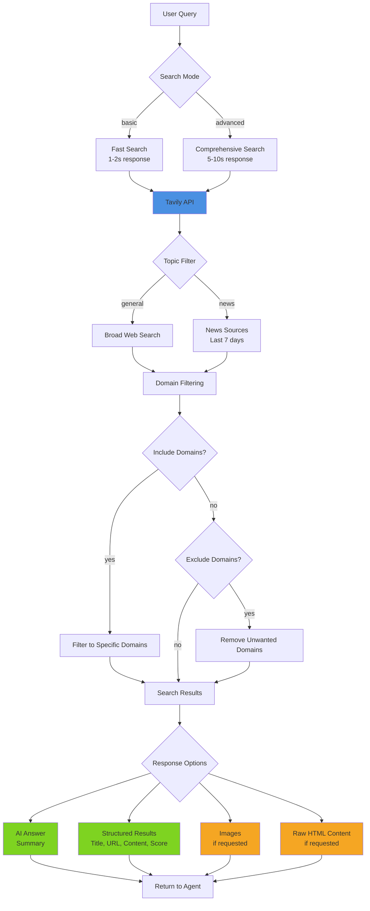

# Tavily AI Search

## Overview

Tavily is a search engine specifically optimized for Large Language Models and AI applications. Unlike traditional search APIs, Tavily provides AI-ready results with optional answer generation, clean content extraction, and domain filtering capabilities.

**Key capabilities:**
- AI-generated answer summaries from search results
- Clean, structured results optimized for LLM processing
- Fast (`basic`) and comprehensive (`advanced`) search modes
- Domain filtering (include/exclude specific sources)
- News-focused search for current events
- Image search with relevant visual content
- Raw content extraction for deeper analysis

## Architecture



## Quick Start

### Basic Search

```bash
# Simple query with AI answer
scripts/tavily_search.py "What is quantum computing?"

# Multiple results
scripts/tavily_search.py "Python best practices" --max-results 10
```

### Advanced Search

```bash
# Comprehensive research mode
scripts/tavily_search.py "Climate change solutions" --depth advanced

# News-focused search
scripts/tavily_search.py "AI developments 2026" --topic news
```

### Domain Filtering

```bash
# Search only trusted domains
scripts/tavily_search.py "Python tutorials" \
  --include-domains python.org docs.python.org realpython.com

# Exclude low-quality sources
scripts/tavily_search.py "How to code" \
  --exclude-domains w3schools.com geeksforgeeks.org
```

### With Images

```bash
# Include relevant images
scripts/tavily_search.py "Eiffel Tower architecture" --images
```

## Search Modes

### Basic vs Advanced

| Mode | Speed | Coverage | Use Case |
|------|-------|----------|----------|
| **basic** | 1-2s | Good | Quick facts, simple queries |
| **advanced** | 5-10s | Excellent | Research, complex topics, comprehensive analysis |

**Decision tree:**
1. Need a quick fact or definition? → Use `basic`
2. Researching a complex topic? → Use `advanced`
3. Need multiple perspectives? → Use `advanced`
4. Time-sensitive query? → Use `basic`

### General vs News

| Topic | Time Range | Sources | Use Case |
|-------|------------|---------|----------|
| **general** | All time | Broad web | Evergreen content, tutorials, documentation |
| **news** | Last 7 days | News sites | Current events, recent developments, breaking news |

**Decision tree:**
1. Query contains "latest", "recent", "current", "today"? → Use `news`
2. Looking for historical or evergreen content? → Use `general`
3. Need up-to-date information? → Use `news`

## API Key Setup

### Option 1: Clawdbot Config (Recommended)

Add to your Clawdbot config:

```json
{
  "skills": {
    "entries": {
      "tavily": {
        "enabled": true,
        "apiKey": "tvly-YOUR_API_KEY_HERE"
      }
    }
  }
}
```

Access in scripts via Clawdbot's config system.

### Option 2: Environment Variable

```bash
export TAVILY_API_KEY="tvly-YOUR_API_KEY_HERE"
```

Add to `~/.clawdbot/.env` or your shell profile.

### Getting an API Key

1. Visit https://tavily.com
2. Sign up for an account
3. Navigate to your dashboard
4. Generate an API key (starts with `tvly-`)
5. Note your plan's rate limits and credit allocation

## Common Use Cases

### 1. Research & Fact-Finding

```bash
# Comprehensive research with answer
scripts/tavily_search.py "Explain quantum entanglement" --depth advanced

# Multiple authoritative sources
scripts/tavily_search.py "Best practices for REST API design" \
  --max-results 10 \
  --include-domains github.com microsoft.com google.com
```

### 2. Current Events

```bash
# Latest news
scripts/tavily_search.py "AI policy updates" --topic news

# Recent developments in a field
scripts/tavily_search.py "quantum computing breakthroughs" \
  --topic news \
  --depth advanced
```

### 3. Domain-Specific Research

```bash
# Academic sources only
scripts/tavily_search.py "machine learning algorithms" \
  --include-domains arxiv.org scholar.google.com ieee.org

# Technical documentation
scripts/tavily_search.py "React hooks guide" \
  --include-domains react.dev
```

### 4. Visual Research

```bash
# Gather visual references
scripts/tavily_search.py "modern web design trends" \
  --images \
  --max-results 10
```

### 5. Content Extraction

```bash
# Get raw HTML content for deeper analysis
scripts/tavily_search.py "Python async/await" \
  --raw-content \
  --max-results 5
```

## Response Handling

### AI Answer

The AI-generated answer provides a concise summary synthesized from search results:

```python
{
  "answer": "Quantum computing is a type of computing that uses quantum-mechanical phenomena..."
}
```

**Use when:**
- Need a quick summary
- Want synthesized information from multiple sources
- Looking for a direct answer to a question

**Skip when** (`--no-answer`):
- Only need source URLs
- Want to form your own synthesis
- Conserving API credits

### Structured Results

Each result includes:
- `title`: Page title
- `url`: Source URL
- `content`: Extracted text snippet
- `score`: Relevance score (0-1)
- `raw_content`: Full HTML (if `--raw-content` enabled)

### Images

When `--images` is enabled, returns URLs of relevant images found during search.

## Best Practices

### 1. Choose the Right Search Depth

- Start with `basic` for most queries (faster, cheaper)
- Escalate to `advanced` only when:
  - Initial results are insufficient
  - Topic is complex or nuanced
  - Need comprehensive coverage

### 2. Use Domain Filtering Strategically

**Include domains for:**
- Academic research (`.edu` domains)
- Official documentation (official project sites)
- Trusted news sources
- Known authoritative sources

**Exclude domains for:**
- Known low-quality content farms
- Irrelevant content types (Pinterest for non-visual queries)
- Sites with paywalls or access restrictions

### 3. Optimize for Cost

- Use `basic` depth as default
- Limit `max_results` to what you'll actually use
- Disable `include_raw_content` unless needed
- Cache results locally for repeated queries

### 4. Handle Errors Gracefully

The script provides helpful error messages:

```bash
# Missing API key
Error: Tavily API key required
Setup: Set TAVILY_API_KEY environment variable or pass --api-key

# Package not installed
Error: tavily-python package not installed
To install: pip install tavily-python
```

## Integration Patterns

### Programmatic Usage

```python
from tavily_search import search

result = search(
    query="What is machine learning?",
    api_key="tvly-...",
    search_depth="advanced",
    max_results=10
)

if result.get("success"):
    print(result["answer"])
    for item in result["results"]:
        print(f"{item['title']}: {item['url']}")
```

### JSON Output for Parsing

```bash
scripts/tavily_search.py "Python tutorials" --json > results.json
```

### Chaining with Other Tools

```bash
# Search and extract content
scripts/tavily_search.py "React documentation" --json | \
  jq -r '.results[].url' | \
  xargs -I {} curl -s {}
```

## Comparison with Other Search APIs

**vs Brave Search:**
- ✅ AI answer generation
- ✅ Raw content extraction
- ✅ Better domain filtering
- ❌ Slower than Brave
- ❌ Costs credits

**vs Perplexity:**
- ✅ More control over sources
- ✅ Raw content available
- ✅ Dedicated news mode
- ≈ Similar answer quality
- ≈ Similar speed

**vs Google Custom Search:**
- ✅ LLM-optimized results
- ✅ Answer generation
- ✅ Simpler API
- ❌ Smaller index
- ≈ Similar cost structure

## Troubleshooting

### Script Won't Run

```bash
# Make executable
chmod +x scripts/tavily_search.py

# Check Python version (requires 3.6+)
python3 --version

# Install dependencies
pip install tavily-python
```

### API Key Issues

```bash
# Verify API key format (should start with tvly-)
echo $TAVILY_API_KEY

# Test with explicit key
scripts/tavily_search.py "test" --api-key "tvly-..."
```

### Rate Limit Errors

- Check your plan's credit allocation at https://tavily.com
- Reduce `max_results` to conserve credits
- Use `basic` depth instead of `advanced`
- Implement local caching for repeated queries

## Resources

See [api-reference.md](references/api-reference.md) for:
- Complete API parameter documentation
- Response format specifications
- Error handling details
- Cost and rate limit information
- Advanced usage examples

## Dependencies

- Python 3.6+
- `tavily-python` package (install: `pip install tavily-python`)
- Valid Tavily API key

## Credits & Attribution

- Tavily API: https://tavily.com
- Python SDK: https://github.com/tavily-ai/tavily-python
- Documentation: https://docs.tavily.com
